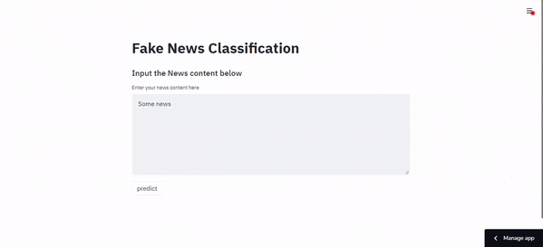

# Fake News Classifier [](https://share.streamlit.io/mlsquad/fake_news/main.py)
An application for detecting fake news using a LSTM model

##  ⚡️ Demo


Live Demo available `https://share.streamlit.io/mlsquad/fake_news/main.py`  

## Platform
The LSTM model was generated using [Tensorflow](https://www.tensorflow.org/)
Frontend was developed and hosted on [Streamlit](https://www.streamlit.io/)  


## 👨🏻‍💻 Local Development
Clone the repo:  
```
git clone https://github.com/MLSquad/fake_news.git
```
cd to `fake_news` directory
Install Python packages:  
```
pip install -r requirements.txt
```

Run application:  
```
streamlit run main.py
```


## 💻 Contributors

- [Angelina Gasharova](https://github.com/angelinag)
- [Nkosilathi Tauro](https://github.com/nkosi-tauro)
- [Egor Tarasov](https://github.com/Jorres)

## 🔑 LICENSE

- MIT